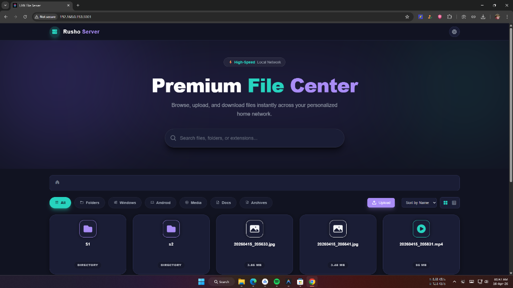

  
  
  
  

 

# 🌟 Premium LAN File & Media Server

A high-speed, fully responsive LAN file server that turns your computer into a premium personal cloud. Built with Node.js, Express, and a beautiful TailwindCSS glassmorphism aesthetic. It supports seamless direct downloads, massive file uploads (over 10GB!), and features a built-in media player perfectly integrated with FFmpeg to dynamically transcode dual-audio MKV & MP4 movies on the fly right to your browser!

### ✨ Key Features
- **Modern & Gorgeous UI**: A sleek, dark-themed, glassmorphic layout perfect for both glowing massive desktop displays and mobile phones.
- **Smart Wi-Fi Detection**: Just run `Start-Server.bat` and it will instantly auto-detect your LAN IP & open the browser automatically. Share the console IP with anyone on your network.
- **Advanced Video Streaming (Plyr.io)**: Watch your movies over Wi-Fi! Dynamically handles Dual-Audio (like English + Hindi) video files directly in the built-in player UI without buffering lag.
- **Lightning-Fast Zip Downloads**: Downloading a directory dynamically packages the whole folder as a high-compression Zip stream instantly. 

---

# 🌟 প্রিমিয়াম ল্যান ফাইল এবং মিডিয়া সার্ভার

একটি অতি-দ্রুত এবং রেস্পন্সিভ ল্যান ফাইল সার্ভার যা আপনার কম্পিউটারকে একটি প্রিমিয়াম পার্সোনাল ক্লাউডে পরিণত করে। এটি Node.js, Express এবং চমৎকার TailwindCSS গ্লাস-মর্ফিজম ডিজাইন দিয়ে তৈরি। এটি যেকোনো মাপের ফাইল (এমনকি ১০ জিবি বা তার বেশি!) আপলোড এবং সরাসরি ডাউনলোড সাপোর্ট করে। এতে একটি বিল্ট-ইন মিডিয়া প্লেয়ার রয়েছে যা FFmpeg-এর সাথে সংযুক্ত, যার মাধ্যমে আপনি আপনার ব্রাউজারেই সরাসরি ডুয়াল-অডিও (যেমন- হিন্দি ও ইংরেজি) MKV এবং MP4 মুভি বাফার ছাড়াই স্ট্রিম করতে পারবেন।

### ✨ মূল বৈশিষ্ট্যসমূহ
- **আধুনিক এবং অসাধারণ ডিজাইন**: একটি স্লিক, ডার্ক-থিম এবং গ্লাসমর্ফিক লেআউট, যা ডেস্কটপ এবং মোবাইল—উভয় স্ক্রিনেই ড্রামাটিক ও দারুণ দেখতে লাগে।
- **স্মার্ট ওয়াই-ফাই ডিটেকশন**: শুধু `Start-Server.bat` রান করলেই এটি স্বয়ংক্রিয়ভাবে আপনার ব্রাউজার ওপেন করবে এবং আপনার ল্যান আইপি (LAN IP) খুঁজে বের করবে। এরপর ব্যাক-কন্সোলে দেখানো সেই আইপি শেয়ার করে নেটওয়ার্কের যে কেউ কানেক্ট করতে পারবে।
- **অ্যাডভান্সড ভিডিও স্ট্রিমিং (Plyr.io)**: ওয়াই-ফাইয়ের মাধ্যমেই সরাসরি মুভি উপভোগ করুন! কোনোরকম বাফারিং ল্যাগ ছাড়াই ডুয়াল-অডিও মুভির (যেমন- হিন্দি + ইংরেজি) ল্যাঙ্গুয়েজ পরিবর্তন করা যাবে সরাসরি প্লেয়ারের ডিভ সেটিংস (Settings) আইকন থেকইে। 
- **বিদ্যুৎ-গতির জিপ (Zip) ডাউনলোড**: যেকোনো ফোল্ডারকে সরাসরি জিপ (Zip) ফরম্যাটে কয়েক সেকেন্ডের মধ্যেই ডাউনলোড করা সম্ভব।

---

## 🚀 How to Run / কিভাবে চালু করবেন

### Requirements:
- `Node.js` installed on your PC.

### Instructions:
1. Download or Clone the repository: `git clone https://github.com/rohan-rusho/speed.git`
2. Run the `Start-Server.bat` file.
3. The server will magically install everything it needs off npm, find your local IP address automatically, AND pop open your browser directly to the gorgeous interface! 🎉
4. Your friends, smart TV, or family on the same Wi-Fi can just type the `http://YOUR-IP:3001` Address seen on the black terminal!
